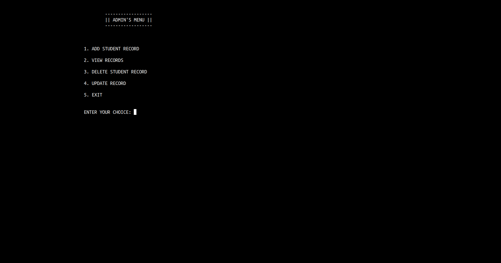
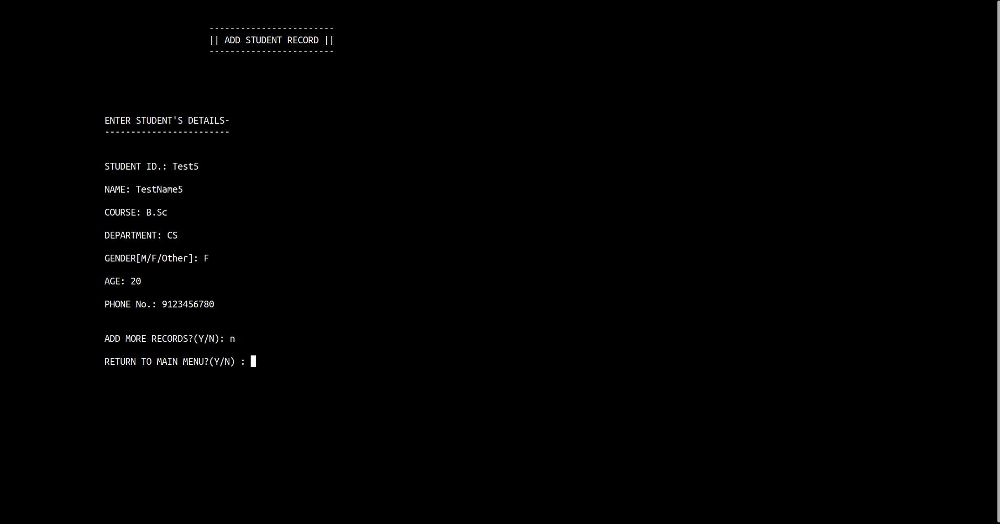
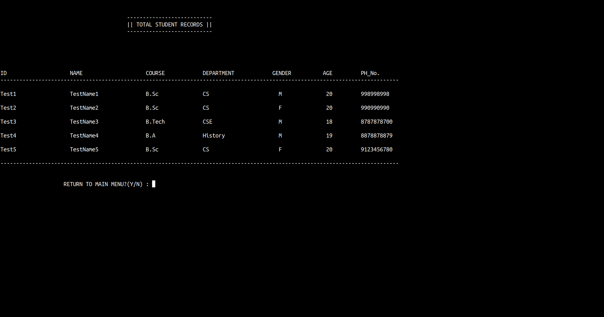

# StudentTracker 📚📊

A simple console program to manage student's official data.

Store records like student_id, name, course, department, phone no., etc. It writes records into a .csv file that can be opened with any spreadsheet software like Google Sheets, Microsoft Excel, LibreOffice Calc.

> **Note**: 
> This program uses the Linux/Unix-specific library `unistd.h` for functions like `sleep()` and `system("clear")`. Compilation on other operating systems like Windows may require some changes, which will be added in the future.

## Introduction

StudentTracker is a user-friendly console program designed to help you efficiently manage and organize student data. It allows you to store, view, update, and delete student records with ease. The program exports records to a CSV file, making it compatible with popular spreadsheet software.

## Features available 🚀

1. **Add Student Records 📝**
   - Duplicate IDs won't be added.

2. **View All Records 👀**
   - Total Records Table View.

3. **Update Records 📤**
   - You can update student records, and there's an option to cancel all changes while updating.

4. **Delete Records 🗑️**
   - Delete any student's records by ID.

5. **Search 🔍**
   - View any student's records by ID.

## Installation

To get and run this program, follow these commands in your terminal:

1. Clone the repository:
   ```
   git clone https://github.com/footcricket05/StudentTracker.git
   ```

2. Change to the program's directory:
   ```
   cd StudentTracker
   ```

3. Compile the program:
   ```
   g++ -o sdm sdm.cpp admin.cpp load.cpp
   ```

4. Run the program:
   ```
   ./sdm
   ```

## Screenshots 📸






## Contributing 🤝

At this time, the project is not accepting contributions. However, you are welcome to use the project as a reference or inspiration for your own projects.

## License 📜

This project is open-source and is licensed under the `MIT License`. Please refer to the LICENSE file for more details.


Enjoy managing your student data with ease! If you have any questions or encounter any issues, please feel free to reach out. Happy data management! 🎉
